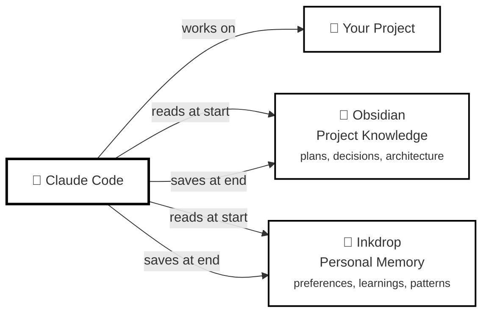

# 🧠 carbon-claude-brain

> Persistent memory for Claude Code using Obsidian as a second brain and Inkdrop as a journal — no databases, no services, no complexity.

[🇧🇷 Versão em Português](README_pt-BR.md)

## How It Works

### Session Lifecycle


### Architecture Overview



**Business Logic:**
1. **Session Start** — Claude automatically loads:
   - Global knowledge (learnings, errors-solved, patterns)
   - Project context and recent decisions
   - Personal preferences from Inkdrop
2. **Work** — Claude codes on your project with full context
3. **Session End** — Claude automatically saves decisions to Obsidian and learnings to Inkdrop

**What gets loaded each session:**
- ⚙️ Personal preferences (Inkdrop)
- 📚 Global learnings (cross-project knowledge)
- 🐛 Previously solved errors
- 🎯 Reusable code patterns
- 📁 Current project context
- 🏛️ Recent technical decisions
- 📔 Last session journal

## Prerequisites

- [Claude Code](https://claude.ai/claude-code) installed
- [Obsidian](https://obsidian.md) with local vault configured
- [Inkdrop](https://www.inkdrop.app) with local server active (`localhost:19840`) — **optional**
- `bash` ≥4.0, `curl`, `node` (usually pre-installed)

## Installation

### Option 1: Marketplace (Recommended)

Install directly from the plugin marketplace:

```bash
# Add the marketplace
/plugin marketplace add marcoscarvalhodearaujo/carbon-claude-brain

# Install the plugin
/plugin install carbon-claude-brain@carbon-claude-brain

# Run the configuration wizard
/carbon-brain-setup
```

#### Configuration Modes

**Interactive Mode (Default):**
The wizard uses intelligent auto-detection and simplified prompts:
- 🔍 **Auto-detects Obsidian vaults** - Parses `obsidian.json` to find your vaults
- 📂 **Visual vault selection** - Shows open vaults highlighted, or manual entry
- 🧪 **Interactive Inkdrop wizard** - Optional 4-step setup with connection testing
- ✅ **Pre-flight validation** - Checks vault access, disk space, and configuration
- 📦 **One-click upgrades** - Preserves existing config, auto-migrates legacy format

**Reduced complexity: 4 manual prompts → 1-2 prompts**

**Non-Interactive Mode (Advanced):**
For automated setup or reproducible configuration:

1. Copy the example config:
   ```bash
   cp ${CLAUDE_PLUGIN_ROOT}/.env.example ${CLAUDE_PLUGIN_ROOT}/.env
   ```

2. Edit `.env` with your settings:
   ```bash
   # Required
   OBSIDIAN_VAULT="/Users/yourname/Documents/MyVault"

   # Optional - leave empty to disable Inkdrop
   INKDROP_URL=""
   INKDROP_USER=""
   INKDROP_PASS=""
   ```

3. Run setup:
   ```bash
   /carbon-brain-setup
   ```

The script will detect the `.env` file and run without prompts.

**Advantages:**
- 🚀 Automatic updates
- 🔧 One-command installation
- 📦 No manual file copying
- ✅ Validated releases

### Option 2: Manual Installation

Clone and install manually:

```bash
git clone https://github.com/marcoscarvalhodearaujo/carbon-claude-brain
cd carbon-claude-brain
./install.sh
```

**What it does:**
- 🔍 **Auto-detects Obsidian vaults** from your system
- 📂 **Shows visual selection** with currently open vaults highlighted
- 🧪 **Optional Inkdrop wizard** with 4-step setup (connection test, credentials, notebook selection)
- ✅ **Validates before installing** (vault access, disk space, Claude Code setup)
- 🔄 **Smart upgrades** - Detects existing installation, preserves config, auto-migrates legacy format

**Simplified prompts:** Usually 1-2 questions instead of 4 manual entries.

**Dry-run mode** (test without changes):
```bash
./install.sh --dry-run
```

**When to use:**
- 🔬 Testing development versions
- 🛠️ Custom modifications
- 📝 Contributing to the project

### ⚠️ Security Note

Inkdrop credentials are stored at `~/.carbon-brain/.env` (standard `.env` format with `600` permissions). This is acceptable because:
- The Inkdrop server is **local** (`localhost:19840`)
- Not exposed to the internet
- Only you have access to your machine
- Standard `.env` format (compatible with Docker, etc.)

**Recommendations:**
- ✅ Use a different password from your Inkdrop Cloud account
- ✅ Keep the local server disabled when not in use
- ❌ **NEVER** version control or share `~/.carbon-brain/.env`
- 🔒 `.env` is already in `.gitignore` by default

**To completely uninstall:**
```bash
./uninstall.sh
```

## What It Does

### Obsidian — Project Knowledge (Local)
- Implementation plans and architecture
- Technical decision logs
- Living project documentation

### Inkdrop — Personal Knowledge (Syncs)
- Personal preferences (applies to all projects)
- Session journals
- General learnings and patterns
- Resolved errors
- **Notebook organization:** Notes can be created in a specific notebook (optional)

## 🤖 Auto-Save (NEW!)

Session summaries are now **saved automatically** when you close Claude Code.

- **What:** Intelligent summary generated by analyzing the session transcript
- **When:** Automatically on session end (Ctrl+C, exit)
- **Where:** Obsidian journals + Inkdrop (if enabled)
- **Model:** Uses Claude Haiku (fast, lightweight)
- **Time:** Adds ~5-10s to session close

**Format saved:**
```markdown
### O que foi feito
- Feature X implemented
- Bug Y fixed

### Erros e aprendizados
- Problem: API timeout → Solution: increased to 5s

### Próximos passos
- [ ] Add tests
- [ ] Deploy to staging
```

**[→ Auto-Save Documentation](docs/auto-save.md)**

You can still use `/carbon-brain-save` manually for more control.

## Available Skills

| Skill | Purpose |
|-------|---------|
| `/carbon-brain-setup` | Run configuration wizard (first-time setup) |
| `/carbon-brain-test` | Verify installation and diagnostics |
| `/carbon-brain-context` | View loaded context |
| `/carbon-brain-plan` | Create/update project plan |
| `/carbon-brain-save` | Save session summary (optional - now auto-saves) |
| `/carbon-brain-search` | Search all projects |
| `/carbon-brain-search-patterns` | Search personal knowledge |
| `/carbon-brain-learn` | Save reusable learning |
| `/carbon-brain-error` | Document solved error |
| `/carbon-brain-setup` | List Inkdrop notebooks and configure destination |

**[→ Complete Skills Documentation](docs/skills-guide.md)**

---

## Token Usage

**Context injection:** ~1500-3000 tokens per session
**Auto-save:** ~2000-10000 tokens per session (uses internal Claude Code agent)

| Session Type | Context Tokens | Auto-Save Tokens | Total | Worth It? |
|-------------|----------------|------------------|-------|-----------|
| Quick (1-3 msgs) | 1500 tokens | ~2000 tokens | ~3500 | ⚖️ Marginal |
| Medium (5-10 msgs) | 2000 tokens | ~5000 tokens | ~7000 | ✅ Yes |
| Long (15+ msgs) | 3000 tokens | ~8000 tokens | ~11000 | ✅ Definitely |

**Note:** Auto-save uses your Claude Code quota/session - no additional API costs.

**Temporarily disable:**
```bash
CARBON_BRAIN_SKIP=1 claude
```

**[→ Token Optimization Guide](docs/token-optimization.md)**

---

## Documentation

### 📚 Setup & Configuration
- [Obsidian Setup](docs/setup-obsidian.md)
- [Inkdrop Setup](docs/setup-inkdrop.md)
- [Personal Preferences](docs/setup-personal-preferences.md)
- [Security Best Practices](docs/security-best-practices.md)

### 🎯 Usage Guides
- [Auto-Save Feature](docs/auto-save.md) - Automatic session summaries
- [Skills Reference](docs/skills-guide.md)
- [Quick Reference Card](docs/quick-reference.md)
- [Token Optimization](docs/token-optimization.md)
- [Troubleshooting](docs/troubleshooting.md)

### 🔍 Comparisons & Decisions
- [vs claude-mem](docs/comparison.md) - Which one to use?

---

## Plugin Structure (For Developers)

This project is structured as a Claude Code marketplace plugin with optimized token usage:

```
carbon-claude-brain/
├── .claude-plugin/
│   └── plugin.json              # Marketplace manifest (metadata only)
├── skills/
│   ├── carbon-brain/            # Main skill (optimized: 525 words, ~700 tokens)
│   │   ├── SKILL.md            # Concise overview with quick reference
│   │   ├── examples/           # Executable bash scripts
│   │   │   ├── brain-save-example.sh
│   │   │   ├── brain-learn-example.sh
│   │   │   ├── brain-error-example.sh
│   │   │   ├── brain-search-example.sh
│   │   │   ├── brain-search-patterns-example.sh
│   │   │   └── brain-test-example.sh
│   │   └── reference/          # Detailed documentation
│   │       └── commands-reference.md
│   ├── carbon-brain-context/   # Individual skill: show loaded context
│   ├── carbon-brain-error/     # Individual skill: document errors
│   ├── carbon-brain-learn/     # Individual skill: save learnings
│   ├── carbon-brain-plan/      # Individual skill: project planning
│   ├── carbon-brain-save/      # Individual skill: save session
│   ├── carbon-brain-search/    # Individual skill: search projects
│   ├── carbon-brain-search-patterns/ # Individual skill: search patterns
│   ├── carbon-brain-setup/     # Individual skill: initial setup
│   └── carbon-brain-test/      # Individual skill: diagnostics
├── hooks/
│   ├── lib-carbon-brain.sh     # Shared library with helper functions
│   ├── session-start.sh        # Loads context at session start
│   ├── session-end.sh          # Saves summary at session end
│   ├── post-tool-use.sh        # Captures important decisions
│   └── auto-save-helper.sh     # Auto-save session summaries
└── templates/
    └── obsidian/               # Templates for vault structure
```

### Token Optimization

The main `carbon-brain` skill was refactored following [superpowers:writing-skills](https://github.com/anthropics/superpowers) guidelines:

- **Before:** ~3500 words (~7000 tokens per session)
- **After:** 525 words (~700 tokens per session)
- **Savings:** 90% reduction (6300 tokens saved per session!)

**Key optimizations:**
- Modular structure with `examples/` and `reference/` subdirectories
- Markdown relative links (marketplace-compatible)
- Quick Reference Table for fast scanning
- Detailed docs moved to separate files
- Executable examples as standalone scripts

### Publishing to Marketplace

The `plugin.json` manifest includes:
- 12 user-invocable skills
- 4 lifecycle hooks (PreToolUse, PostToolUse, Stop, SessionEnd)
- Configuration schema for setup wizard
- Dependencies and keywords for discoverability

**Local testing:**
```bash
# Test as local plugin before publishing
claude --plugin-dir ./carbon-claude-brain
```

**Structure requirements:**
- ⚠️ **IMPORTANT:** Only `plugin.json` goes inside `.claude-plugin/`
- All other directories (`skills/`, `hooks/`, `templates/`) must be at plugin root
- Skills use relative markdown links: `[text](file.md)`
- Examples are executable with proper shebang: `#!/usr/bin/env bash`

---

## Contributing

Contributions welcome! See [CONTRIBUTING.md](CONTRIBUTING.md).

**Security:** [SECURITY.md](SECURITY.md) | **Branch Protection:** [docs/branch-protection.md](docs/branch-protection.md)

---

## Uninstall

```bash
./uninstall.sh
```

## License

MIT

---

**Made with ❤️ for developers who value simplicity and data ownership**
