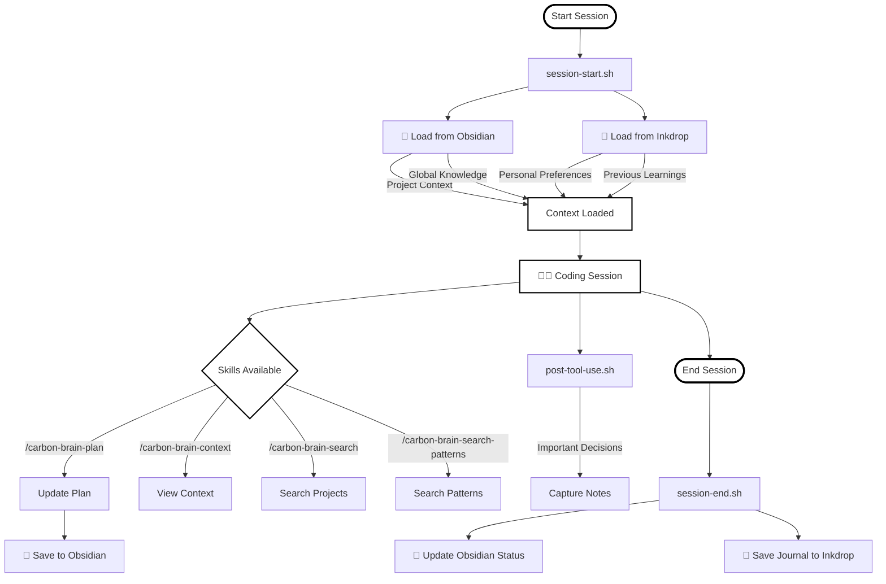
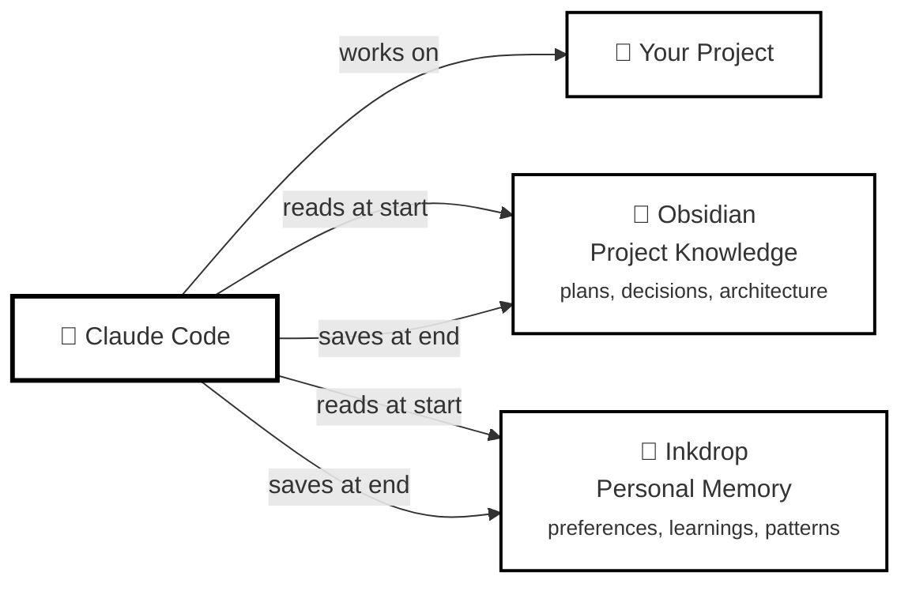

# 🧠 carbon-claude-brain

> Persistent memory for Claude Code using Obsidian as a second brain and Inkdrop as a journal — no databases, no services, no complexity.

[🇧🇷 Versão em Português](README_pt-BR.md)

---

## What It Does

**Gives Claude Code a memory** across sessions using local markdown files:

- **Obsidian** → Project knowledge (plans, decisions, architecture)
- **Inkdrop** → Personal memory (preferences, learnings, patterns) - *optional*

**Every session:**
1. Claude loads context automatically (global knowledge + project context)
2. You work normally
3. Claude saves learnings automatically when you close

**No cloud dependencies. No databases. Just markdown files you own.**

---

## How It Works

### Session Lifecycle



### Architecture Overview



**What gets loaded each session:**
- ⚙️ Personal preferences (Inkdrop)
- 📚 Global learnings (cross-project knowledge)
- 🐛 Previously solved errors
- 🎯 Reusable code patterns
- 📁 Current project context
- 🏛️ Recent technical decisions
- 📔 Last session journal

---

## Key Features

### 🤖 Auto-Save Sessions
Session summaries are **saved automatically** when you close Claude Code:
- Intelligent summary generated by Claude Haiku
- Saves to Obsidian journals + Inkdrop
- Adds ~5-10s to session close
- [→ Auto-Save Documentation](docs/auto-save.md)

### 🧠 Global Knowledge System
Cross-project knowledge loaded in every session:
- **learnings.md** - Best practices and insights
- **errors-solved.md** - Documented solutions
- **patterns.md** - Code patterns

### 📦 Intelligent Installation
- 🔍 Auto-detects Obsidian vaults from system
- 📂 Visual vault selection (shows open vaults)
- 🧪 Interactive Inkdrop wizard (optional)
- ✅ Pre-flight validation
- 🔄 Smart upgrades with config preservation

**4 manual prompts → 1-2 prompts** (80%+ auto-detection)

### ⚡ Token Optimization
- Context injection: ~1500-3000 tokens/session
- Auto-save: ~2000-8000 tokens/session
- Main skill: 90% reduction (700 tokens vs 7000)
- [→ Token Optimization Guide](docs/token-optimization.md)

---

## Installation

### Option 1: Marketplace (Recommended)

```bash
# Add marketplace
/plugin marketplace add marcoscarbonera/carbon-claude-brain

# Install plugin
/plugin install carbon-claude-brain@carbon-claude-brain

# Run setup wizard
/carbon-brain-setup
```

**Advantages:**
- 🚀 Automatic updates
- 🔧 One-command installation
- ✅ Validated releases

### Option 2: Manual Installation

```bash
git clone https://github.com/marcoscarbonera/carbon-claude-brain
cd carbon-claude-brain
./install.sh
```

**When to use:**
- Testing development versions
- Custom modifications
- Contributing to the project

**Dry-run mode:**
```bash
./install.sh --dry-run
```

---

## Available Skills

| Skill | Purpose |
|-------|---------|
| `/carbon-brain-setup` | Configuration wizard (first-time setup) |
| `/carbon-brain-test` | Verify installation and diagnostics |
| `/carbon-brain-context` | View loaded context |
| `/carbon-brain-plan` | Create/update project plan |
| `/carbon-brain-save` | Save session summary manually |
| `/carbon-brain-search` | Search all projects |
| `/carbon-brain-search-patterns` | Search personal knowledge |
| `/carbon-brain-learn` | Save reusable learning |
| `/carbon-brain-error` | Document solved error |

**[→ Complete Skills Documentation](docs/skills-guide.md)**

---

## Requirements

- [Claude Code](https://claude.ai/claude-code) installed
- [Obsidian](https://obsidian.md) with local vault
- [Inkdrop](https://www.inkdrop.app) with local server (`localhost:19840`) - **optional**
- `bash` ≥4.0, `curl`, `node` ≥14.0

---

## Documentation

### 📚 Setup & Configuration
- [Obsidian Setup](docs/setup-obsidian.md)
- [Inkdrop Setup](docs/setup-inkdrop.md)
- [Personal Preferences](docs/setup-personal-preferences.md)
- [Security Best Practices](docs/security-best-practices.md)

### 🎯 Usage Guides
- [Auto-Save Feature](docs/auto-save.md) - Automatic session summaries
- [Skills Reference](docs/skills-guide.md)
- [Quick Reference Card](docs/quick-reference.md)
- [Token Optimization](docs/token-optimization.md)
- [Troubleshooting](docs/troubleshooting.md)

### 🔍 Comparisons
- [vs claude-mem](docs/comparison.md) - Which one to use?

### 🛠️ For Developers
- [Plugin Structure](docs/plugin-structure.md) - How it's organized
- [Contributing Guide](CONTRIBUTING.md)
- [Security Policy](SECURITY.md)

---

## Quick Start

```bash
# 1. Install from marketplace
/plugin marketplace add marcoscarbonera/carbon-claude-brain
/plugin install carbon-claude-brain@carbon-claude-brain

# 2. Run setup wizard
/carbon-brain-setup

# 3. Start coding - context loads automatically
claude

# 4. Use skills during session
/carbon-brain-plan     # Update project plan
/carbon-brain-learn    # Save a learning

# 5. Close normally - auto-saves session summary
# (Ctrl+C or exit)
```

---

## Token Usage

| Session Type | Context | Auto-Save | Total | Worth It? |
|-------------|---------|-----------|-------|-----------|
| Quick (1-3 msgs) | 1500 | ~2000 | ~3500 | ⚖️ Marginal |
| Medium (5-10 msgs) | 2000 | ~5000 | ~7000 | ✅ Yes |
| Long (15+ msgs) | 3000 | ~8000 | ~11000 | ✅ Definitely |

**Disable temporarily:**
```bash
CARBON_BRAIN_SKIP=1 claude
```

---

## Uninstall

```bash
./uninstall.sh
```

Removes hooks, skills, and configuration (keeps Obsidian vault).

---

## Contributing

Contributions welcome! See [CONTRIBUTING.md](CONTRIBUTING.md).

**Security:** [SECURITY.md](SECURITY.md)

---

## License

MIT

---

**Made with ❤️ for developers who value simplicity and data ownership**
