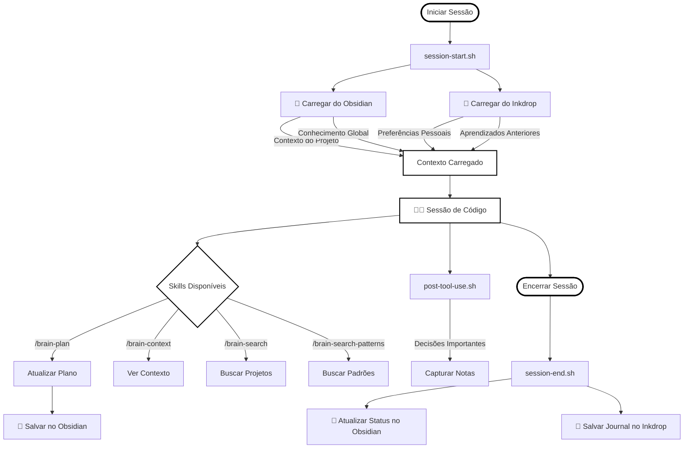
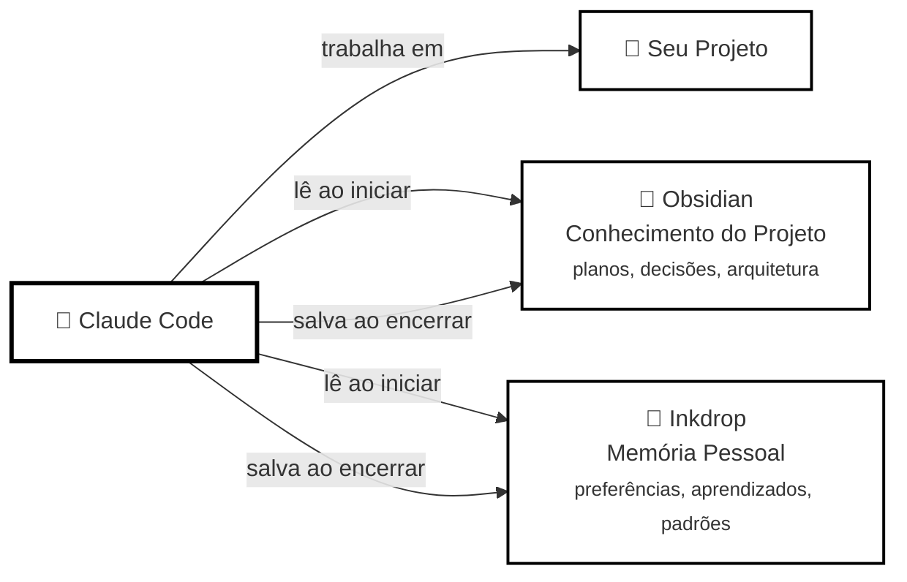

# 🧠 carbon-claude-brain

> Memória persistente para o Claude Code usando Obsidian como segundo cérebro e Inkdrop como journal — sem banco de dados, sem serviços, sem complexidade.

[🇺🇸 English Version](README.md)

## Como funciona

### Ciclo de Vida de uma Sessão



### Visão Geral da Arquitetura



**Regra de Negócio:**
1. **Início da Sessão** — Claude carrega automaticamente:
   - Conhecimento global (aprendizados, erros resolvidos, padrões)
   - Contexto do projeto e decisões recentes
   - Preferências pessoais do Inkdrop
2. **Trabalho** — Claude programa no seu projeto com contexto completo
3. **Fim da Sessão** — Claude salva automaticamente decisões no Obsidian e aprendizados no Inkdrop

**O que é carregado em cada sessão:**
- ⚙️ Preferências pessoais (Inkdrop)
- 📚 Aprendizados globais (conhecimento cross-project)
- 🐛 Erros previamente resolvidos
- 🎯 Padrões de código reutilizáveis
- 📁 Contexto do projeto atual
- 🏛️ Decisões técnicas recentes
- 📔 Journal da última sessão

## Pré-requisitos

- [Claude Code](https://claude.ai/claude-code) instalado
- [Obsidian](https://obsidian.md) com vault local configurado
- [Inkdrop](https://www.inkdrop.app) com servidor local ativo (`localhost:19840`)

## Instalação

```bash
git clone https://github.com/marcoscarbonera/carbon-claude-brain
cd carbon-claude-brain
./install.sh
```

O script vai perguntar:
- Caminho do vault do Obsidian
- Credenciais do servidor local do Inkdrop

### ⚠️ Nota sobre Segurança

As credenciais do Inkdrop são armazenadas em `~/.carbon-brain/.env` (formato padrão `.env` com permissões `600`). Isso é aceitável porque:
- O servidor do Inkdrop é **local** (`localhost:19840`)
- Não é exposto à internet
- Apenas você tem acesso à sua máquina
- Formato `.env` padrão universal (compatível com Docker, etc.)

**Recomendações:**
- ✅ Use senha diferente do seu Inkdrop Cloud
- ✅ Mantenha o servidor local desabilitado quando não usar
- ❌ **NUNCA** versione ou compartilhe `~/.carbon-brain/.env`
- 🔒 `.env` já está no `.gitignore` por padrão

**Para desinstalar completamente:**
```bash
./uninstall.sh
```

## O Que Faz

### Obsidian — Conhecimento do Projeto (Local)
- Planos e arquitetura de implementação
- Log de decisões técnicas
- Documentação viva do projeto

### Inkdrop — Conhecimento Pessoal (Sincroniza)
- Preferências pessoais (aplicam a todos os projetos)
- Journals de sessões
- Aprendizados gerais e padrões
- Erros resolvidos

## 🤖 Auto-Save (NOVO!)

Resumos de sessão agora são **salvos automaticamente** quando você fecha o Claude Code.

- **O que:** Resumo inteligente gerado analisando o transcript da sessão
- **Quando:** Automaticamente ao encerrar sessão (Ctrl+C, exit)
- **Onde:** Journals do Obsidian + Inkdrop (se habilitado)
- **Modelo:** Usa Claude Haiku (rápido, leve)
- **Tempo:** Adiciona ~5-10s ao fechamento da sessão

**Formato salvo:**
```markdown
### O que foi feito
- Feature X implementada
- Bug Y corrigido

### Erros e aprendizados
- Problema: timeout na API → Solução: aumentei para 5s

### Próximos passos
- [ ] Adicionar testes
- [ ] Deploy em staging
```

**[→ Documentação do Auto-Save](docs/auto-save.md)**

Você ainda pode usar `/brain-save` manualmente para ter mais controle.

## Skills Disponíveis

| Skill | Propósito |
|-------|-----------|
| `/brain-test` | Verificar instalação |
| `/brain-context` | Ver contexto carregado |
| `/brain-plan` | Criar/atualizar plano do projeto |
| `/brain-save` | Salvar resumo da sessão (opcional - agora auto-salva) |
| `/brain-search` | Buscar em todos os projetos |
| `/brain-search-patterns` | Buscar conhecimento pessoal |

**[→ Documentação Completa dos Skills](docs/skills-guide.md)**

---

## Uso de Tokens

**Injeção de contexto:** ~1500-3000 tokens por sessão
**Auto-save:** ~2000-10000 tokens por sessão (usa agent interno do Claude Code)

| Tipo de Sessão | Tokens Contexto | Tokens Auto-Save | Total | Vale a Pena? |
|----------------|-----------------|------------------|-------|--------------|
| Rápida (1-3 msgs) | 1500 tokens | ~2000 tokens | ~3500 | ⚖️ Marginal |
| Média (5-10 msgs) | 2000 tokens | ~5000 tokens | ~7000 | ✅ Sim |
| Longa (15+ msgs) | 3000 tokens | ~8000 tokens | ~11000 | ✅ Definitivamente |

**Nota:** Auto-save usa sua cota/sessão do Claude Code - sem custos adicionais de API.

**Desabilitar temporariamente:**
```bash
CARBON_BRAIN_SKIP=1 claude
```

**[→ Guia de Otimização de Tokens](docs/token-optimization.md)**

---

## Documentação

### 📚 Setup & Configuração
- [Setup do Obsidian](docs/setup-obsidian.md)
- [Setup do Inkdrop](docs/setup-inkdrop.md)
- [Preferências Pessoais](docs/setup-personal-preferences.md)
- [Melhores Práticas de Segurança](docs/security-best-practices.md)

### 🎯 Guias de Uso
- [Auto-Save Feature](docs/auto-save.md) - Resumos automáticos de sessão
- [Referência de Skills](docs/skills-guide.md)
- [Cartão de Referência Rápida](docs/quick-reference.md)
- [Otimização de Tokens](docs/token-optimization.md)
- [Troubleshooting](docs/troubleshooting.md)

### 🔍 Comparações & Decisões
- [vs claude-mem](docs/comparison.md) - Qual usar?

---

## Contribuindo

Contribuições são bem-vindas! Veja [CONTRIBUTING.md](CONTRIBUTING.md).

**Segurança:** [SECURITY.md](SECURITY.md) | **Branch Protection:** [docs/branch-protection.md](docs/branch-protection.md)

---

## Desinstalar

```bash
./uninstall.sh
```

## Licença

MIT
