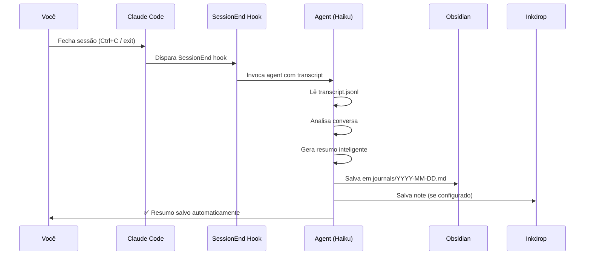

# 🤖 Auto-Save Inteligente

O carbon-claude-brain agora salva automaticamente um resumo da sua sessão quando você fecha o Claude Code.

## Como Funciona



## O Que É Salvo

O agente analisa toda a conversa da sessão e gera um resumo estruturado:

### Formato do Resumo

```markdown
### O que foi feito
- Implementei feature X
- Corrigi bug Y
- Refatorei componente Z

### Erros e aprendizados
- Problema: timeout na API
  Solução: aumentei timeout para 5s
- Aprendi que validação deve ser feita no backend

### Próximos passos
- [ ] Adicionar testes unitários
- [ ] Deploy em staging
- [ ] Revisar documentação
```

## Onde É Salvo

**Obsidian (SEMPRE):**
- Local: `$OBSIDIAN_VAULT/_claude-brain/global/journals/YYYY-MM-DD.md`
- Uma nota por dia
- Múltiplas sessões = append com separador `---`

**Inkdrop (SE CONFIGURADO):**
- Título: `Journal nome-do-projeto — YYYY-MM-DD`
- Tags: `claude-journal`, `nome-do-projeto`
- Sincroniza entre máquinas

## Tecnologia

### Hook Agent
O auto-save usa um **hook do tipo "agent"** que:
1. Executa no evento `SessionEnd`
2. Usa Claude Haiku (modelo rápido e leve)
3. Tem acesso ao transcript completo da sessão
4. Pode usar ferramentas (Bash, Read, Write)
5. Roda **dentro do Claude Code** (sem chamadas externas)

### Por Que Haiku?
- ⚡ Rápido (salva em ~5-10 segundos)
- 💡 Leve (consome menos tokens da sua sessão)
- 🎯 Suficiente para gerar resumos concisos
- ✅ Integrado ao Claude Code (sem configuração extra)

### Timeout
- Padrão: 60 segundos
- Ajustável no `~/.claude/settings.json`

## Consumo de Tokens

| Sessão | Tokens Consumidos |
|--------|-------------------|
| Curta (5 msgs) | ~2000 tokens |
| Média (20 msgs) | ~5000 tokens |
| Longa (50+ msgs) | ~8000 tokens |

**Nota:** Usa sua cota do Claude Code - sem custos adicionais de API.
O consumo de tokens faz parte da sua sessão normal.

## Configuração

O auto-save é instalado automaticamente pelo `install.sh`.

Para verificar se está configurado:

```bash
cat ~/.claude/settings.json | grep SessionEnd
```

Deve mostrar algo como:

```json
"SessionEnd": [
  {
    "matcher": "",
    "hooks": [
      {
        "type": "agent",
        "prompt": "You are about to auto-save...",
        "model": "claude-haiku-4",
        "timeout": 60000
      }
    ]
  }
]
```

## Desabilitar Temporariamente

Se não quiser auto-save em uma sessão específica:

```bash
# Opção 1: Desabilitar todo o carbon-brain
CARBON_BRAIN_SKIP=1 claude

# Opção 2: Remover hook SessionEnd temporariamente
# Editar ~/.claude/settings.json e comentar a seção SessionEnd
```

## Desabilitar Permanentemente

Para desabilitar apenas o auto-save (mantendo outras funcionalidades):

1. Edite `~/.claude/settings.json`
2. Remova ou comente a seção `hooks.SessionEnd`
3. Mantenha as outras seções (PreToolUse, PostToolUse, Stop)

Você ainda pode usar `/brain-save` manualmente quando quiser.

## Troubleshooting

### Auto-save não está salvando

**Verificar hook registrado:**
```bash
grep -A 5 "SessionEnd" ~/.claude/settings.json
```

**Verificar logs:**
```bash
tail -f ~/.carbon-brain/errors.log
```

**Reinstalar:**
```bash
./uninstall.sh
./install.sh
```

### Resumo está incompleto

O agent usa Haiku, que é mais conciso. Se preferir resumos mais detalhados:

1. Edite `~/.claude/settings.json`
2. Mude `"model": "claude-haiku-4"` para `"model": "claude-sonnet-4"`
3. Aviso: consome ~5x mais tokens por sessão

### Sessão demora para fechar

O auto-save adiciona ~5-10s ao tempo de fechamento (Haiku analisa e salva).

Se isso incomoda:
- Use Haiku (mais rápido)
- Ou desabilite auto-save e use `/brain-save` manualmente

## Comparação: Auto vs Manual

| Aspecto | Auto-Save | `/brain-save` Manual |
|---------|-----------|----------------------|
| **Esforço** | Zero | Precisa lembrar |
| **Velocidade** | +5-10s ao fechar | Instantâneo |
| **Tokens** | ~2-8k tokens/sessão | Depende do que você escrever |
| **Qualidade** | Haiku (boa) | Você decide |
| **Controle** | Automático | Total |

## FAQ

**P: O auto-save funciona se eu fechar o terminal bruscamente?**
R: Não. O hook SessionEnd só dispara em fechamento gracioso (Ctrl+C, `exit`, etc).

**P: Posso editar o resumo depois?**
R: Sim! Os arquivos ficam em `$OBSIDIAN_VAULT/_claude-brain/global/journals/`.

**P: E se eu não quiser salvar uma sessão específica?**
R: Use `CARBON_BRAIN_SKIP=1 claude` para sessões que não quer registrar.

**P: O resumo vai para o Inkdrop também?**
R: Sim, se você configurou Inkdrop no `install.sh`.

**P: Qual o tamanho médio do resumo?**
R: ~100-300 palavras (depende do tamanho da sessão).

**P: Posso customizar o prompt do agent?**
R: Sim! Edite a seção `autoSavePrompt` no `~/.claude/settings.json`.

---

**Próximos passos:**
- [← Voltar para README](../README.md)
- [Troubleshooting completo](troubleshooting.md)
- [Token Optimization](token-optimization.md)
