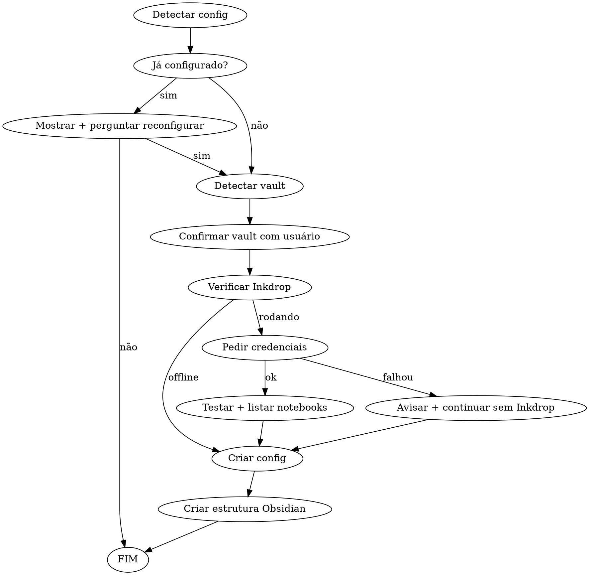

# /carbon-brain-setup — Wizard de Configuração

Claude executa o setup diretamente na conversa — sem terminal interativo.

## Fluxo



## Passo 1 — Detectar config existente

```bash
# Detectar CONFIG_DIR
if [ -n "$CLAUDE_PLUGIN_DATA" ]; then
  CONFIG_DIR="$CLAUDE_PLUGIN_DATA"
else
  CONFIG_DIR="$HOME/.carbon-brain"
fi
echo "CONFIG_DIR=$CONFIG_DIR"
cat "$CONFIG_DIR/.env" 2>/dev/null || echo "NO_CONFIG"
```

Se config existir: mostrar valores atuais (**omitir senha**) e perguntar ao usuário se quer reconfigurar. Se não, encerrar.

## Passo 2 — Detectar vault Obsidian

```bash
# Método primário: obsidian.json
node -e "
  const fs = require('fs');
  const home = require('os').homedir();
  const f = home + '/Library/Application Support/obsidian/obsidian.json';
  try {
    const d = JSON.parse(fs.readFileSync(f, 'utf8'));
    Object.values(d.vaults || {}).forEach(v => {
      console.log(v.path + (v.open ? ' [ABERTO]' : ''));
    });
  } catch(e) { console.log('NOT_FOUND'); }
" 2>/dev/null

# Fallback: caminhos comuns
[ -d "$HOME/Documents/Obsidian Vault" ] && echo "$HOME/Documents/Obsidian Vault"
[ -d "$HOME/Obsidian" ] && echo "$HOME/Obsidian"
```

Apresentar vaults encontrados numerados. Perguntar: **"Qual vault usar? (número ou caminho completo)"**

## Passo 3 — Verificar Inkdrop

```bash
curl -s --max-time 3 http://localhost:19840/books 2>&1 | head -1
```

- `Invalid credentials` → Inkdrop rodando → perguntar: **"Inkdrop detectado. Deseja configurar? [S/n]"**
- Connection refused / timeout → offline → pular, continuar sem Inkdrop

## Passo 4 — Testar credenciais e listar notebooks

Pedir usuário e senha. Testar:

```bash
curl -s --max-time 5 -u "$INKDROP_USER:$INKDROP_PASS" \
  "http://localhost:19840/books" | \
node -e "
  const data = JSON.parse(require('fs').readFileSync('/dev/stdin','utf8'));
  if (data.error) { console.log('AUTH_FAILED'); process.exit(1); }
  const books = data.items || [];
  const roots = books.filter(b => !b.parentBookId);
  const children = books.filter(b => b.parentBookId);
  roots.forEach(b => {
    console.log('📁 ' + b.name + '  [' + b._id + ']');
    children.filter(c => c.parentBookId === b._id).forEach(c => {
      console.log('   📂 ' + c.name + '  [' + c._id + ']');
    });
  });
"
```

Mostrar lista e perguntar: **"ID do notebook para journals (vazio = inbox):"**

## Passo 5 — Criar .env

Usar **Write tool** para criar `$CONFIG_DIR/.env`:

```
# carbon-claude-brain — Configuração
# Gerado em: [data atual]

OBSIDIAN_VAULT="[caminho confirmado]"
INKDROP_URL="[http://localhost:19840 ou vazio]"
INKDROP_USER="[valor ou vazio]"
INKDROP_PASS="[valor ou vazio]"
INKDROP_NOTEBOOK_ID="[valor ou vazio]"
```

```bash
chmod 600 "$CONFIG_DIR/.env"
```

## Passo 6 — Criar estrutura no Obsidian

```bash
BRAIN_DIR="$OBSIDIAN_VAULT/_claude-brain"
mkdir -p "$BRAIN_DIR/global/journals" "$BRAIN_DIR/projects"
```

Criar com **Write tool** se não existirem:
- `$BRAIN_DIR/global/learnings.md` — cabeçalho com seções Performance, Segurança, Arquitetura, Testes
- `$BRAIN_DIR/global/errors-solved.md` — cabeçalho vazio
- `$BRAIN_DIR/global/patterns.md` — cabeçalho vazio

## Passo 7 — Confirmar

```bash
cat "$CONFIG_DIR/.env"
ls "$OBSIDIAN_VAULT/_claude-brain/global/"
```

Mostrar resumo e sugerir `/carbon-brain-test` para validar.

---

## Regras

- **Nunca mostrar senha** em output — usar `****`
- Se usuário cancelar em qualquer passo, não criar arquivo parcial
- `chmod 600` no `.env` é obrigatório
